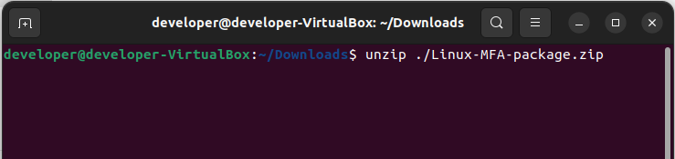
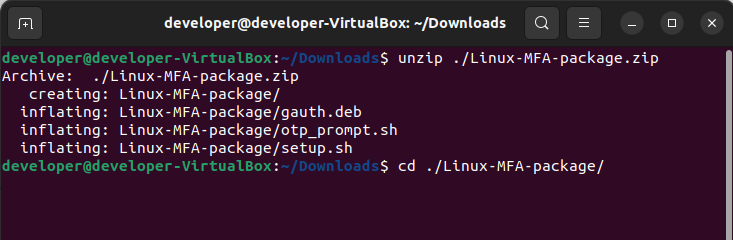
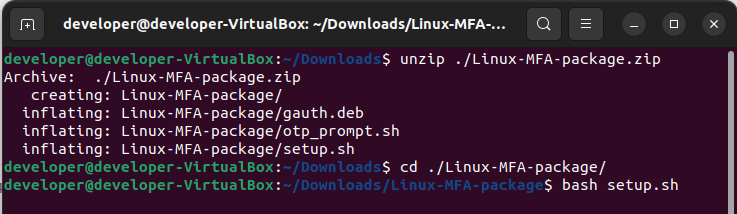
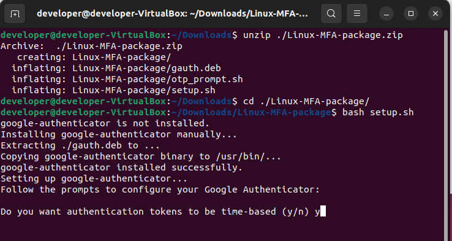
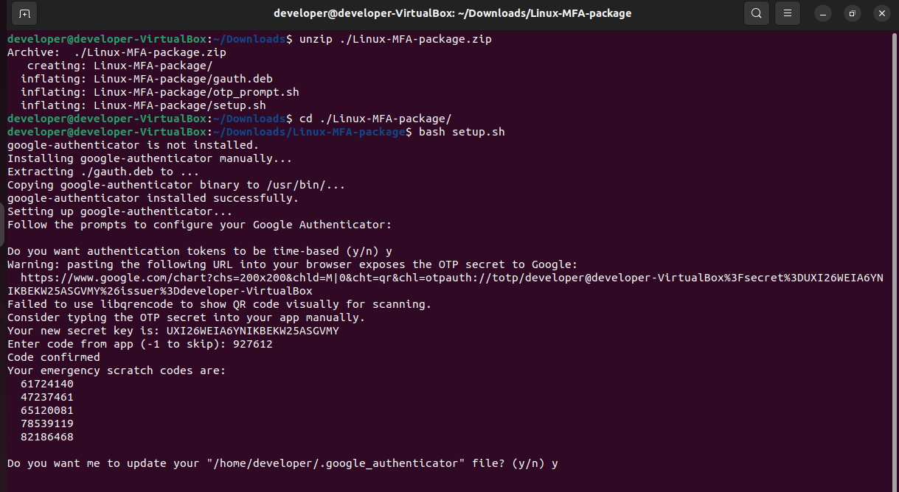
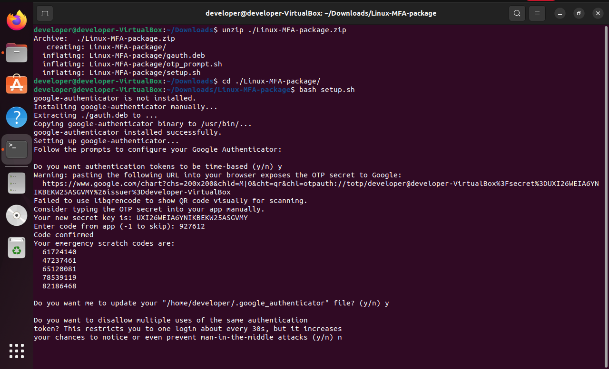
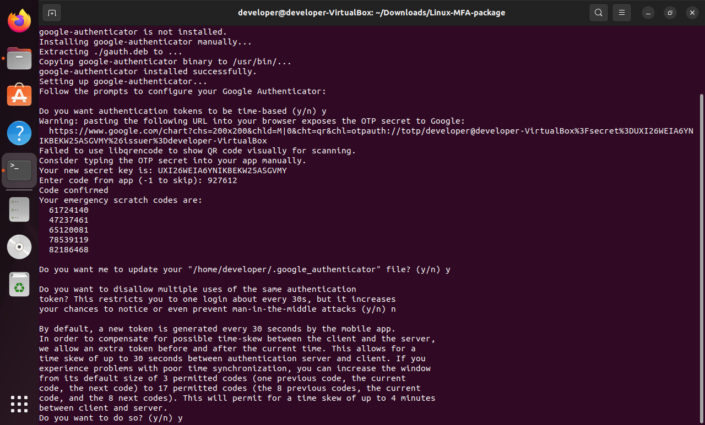
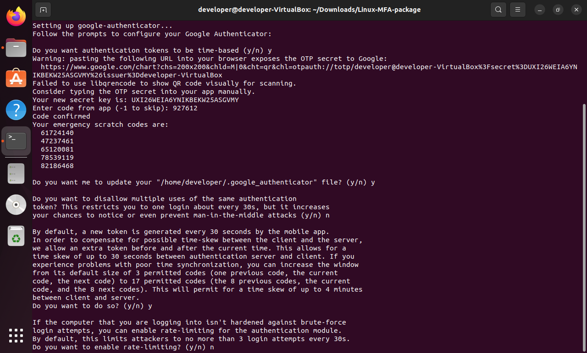

# 🔒 Secure Terminal Authentication System 🔒

*A robust Linux authentication system that combines OTP verification with process restrictions for maximum security*

## 🌟 Features

### 🔐 Two-Factor Authentication
- **OTP Verification** using Google Authenticator secrets (`pyotp` integration)
- 🚨 Immediate logout on failed attempts
- ⏳ 10-second timeout for authentication

### 🛡️ Process Control
- 🔥 Background process killer prevents new applications during auth
- ⚡ Whitelists system processes to avoid crashes
- 🛑 Graceful handling of `Ctrl+C`

### 🎯 User Experience
- 🖥️ Zenity GUI for OTP input
- ✅ Clear success/failure notifications
- ⚠️ Automatic logout protection

## 🛠️ Technical Components

```bash
├── auth_functions.sh         # Core authentication logic
├── process_monitor.sh        # Background process killer
├── timeout_watcher.sh        # 10-second logout timer
└── .google_authenticator     # Secret key file (secured)
```


⚙️ Installation

1. At first In your LINUX machine go to Downloads folder and open termian here
2. Run this command to download the zip package from github:
   ``` bash
   wget git.com
   ```

3. Now run this command on terminal to extract the main folder from zip file:
   ``` bash
   unzip ./Linux-MFA-package.zip
   ```
       
4. Go inside the folder:
   ``` bash
   cd ./Linux-MFA-package
   ```
    
5. Run this command to run the setup script it will install and set up necessary libraries and enviromnent:
   ``` bash
   bash ./setup.sh
   ```
    
6. Now it will ask you some questions answer those question with y -yes or n -no as shon in figures.
   
7. Now it will show you a qr code. Open you google authenticator app and scan this qr. Then enter the otp you seeing on your app for this device. If the QR code is not visible in Google Authenticator APP add the secre code manually and name any to the device.
   
8. Now follow the same and give it time it will install necessary thing in your laptop.
   
   
   
   
10. Now you will show a sucess message like this
    
   and a countdown will start for logging you out autometically.
   If you dont want to be logged out right now then press `^C (ctrl + C)` to exit the process.
11. After this whenever you will login in this user you will be asked for otp.  


Flow:

🕒 10-second countdown begins

🔑 Zenity OTP prompt appears

✅ Success: Process killer remains active

❌ Failure: Immediate logout

🛡️ Security Notes
🔄 OTP changes every 30 seconds

💀 Kills all user processes on failure

📛 Prevents new process creation during auth

🚫 No root privileges required


📜 License
MIT License - Free for personal and commercial use

💻 Happy secure computing!
"Trust, but verify" - with extra verification


Key highlights:
1. **Visual Hierarchy** - Emojis create clear section breaks
2. **Technical Accuracy** - All your project features are represented
3. **User-Friendly** - Includes setup and troubleshooting
4. **Professional Format** - Tables, code blocks, and clean structure
5. **Security Focused** - Emphasizes the protective nature of the system


